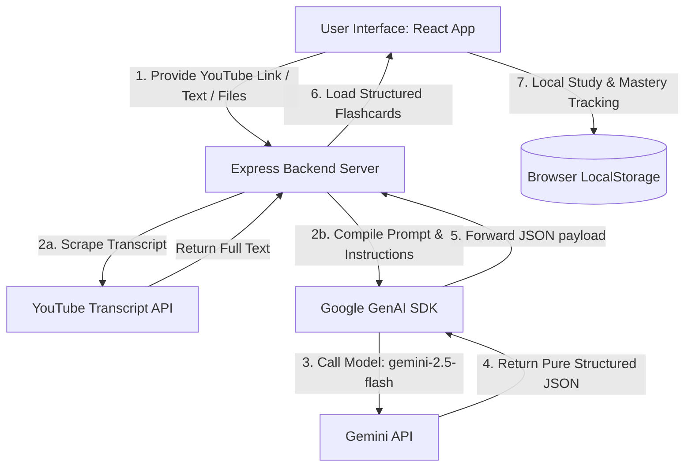

# 📝 AI Flashcards Study Tool (MVP)

> **"The Encouraging Tutor"** — A playful, visually stunning, and highly tactile web application designed to turn the often-tedious process of memorization into an engaging, interactive journey. Convert any text, YouTube video transcript, or document into high-quality flashcards using Google's advanced **Gemini 2.5 Flash** model, and study them with an intuitive learning feedback loop.

---

## 🎯 Project Goal

The primary goal of this tool is to bridge the gap between consuming educational content and active recall. By allowing learners to quickly import materials from multiple formats (text inputs, YouTube URLs, documents) and feed them to a localized AI agent, the app generates custom, bite-sized study cards in seconds. Combined with a tactile card-review interface, it provides a high-retention feedback loop that helps users identify their core strengths and weaknesses.

---

## 🎨 Visual Identity & Design System

The application rejects corporate stiffness in favor of an **Organic Play** design philosophy. It is built to feel more like a physical toy or a well-loved notebook than a rigid dashboard.

*   **Color Palette**: Rooted in warm, grounded earth tones to reduce eye strain:
    *   **Primary Background**: Light Cream (`#E4D6A9` / `#fff8f6`) serving as a soft, comforting canvas.
    *   **Accents**: Rich Dark Brown (`#622B14`) for primary text and heavy action buttons; Muted Olive (`#978F66`) for secondary states.
    *   **Semantic Feedback**: Mastery-based statuses: **Strong** (Soft Green: `#9AD872`), **Medium** (Warm Orange: `#E87F24`), and **Weak** (Muted Red: `#FF3737`).
*   **Typography**:
    *   **Rubik**: A distinctively rounded sans-serif font for chunkier, friendly headers and labels.
    *   **Plus Jakarta Sans**: A clean, highly legible typeface for body text and flashcard content.
*   **Tactile Depth**: Avoids flat web tropes. It utilizes **Playful Ambient Shadows** (thick sticker-like borders shifted primarily on the Y-axis) and mechanical button-press states (buttons physically sink on click as their shadows disappear).
*   **Shapes**: Pill-shaped buttons and inputs with ultra-rounded corners (`rounded-3xl`) to present a soft and safe aesthetic.

---

## ✨ Features

The MVP features a focused, zero-distraction system comprised of three main pages:

### 1. 🏠 Home Page (Flashcard Sets Dashboard)
*   **Visual Directory**: Displays all your saved flashcard sets.
*   **Set Cards**: Each set displays its title, optional description, a custom **"Bubble Bar"** progress percentage, and a performance status color based on your mastery.
*   **Filtering Options**:
    *   *By Mastery Status*: Focus only on Weak, Medium, or Strong categories.
    *   *By Source*: Filter between AI-Generated sets and Manually Created sets.

### 2. ➕ Create / Edit Set Page
*   **Dual Modes**:
    *   **Manual Mode**: Fill in standard Front (question/term) and Back (answer/explanation) fields.
    *   **AI Mode**: Instantly generate flashcards using advanced AI.
*   **Rich AI Import Formats**:
    *   **Text Blocks**: Copy/paste lecture notes, articles, or books.
    *   **YouTube Videos**: Enter a YouTube URL, and the server automatically scrapes the video's live transcript to generate cards.
    *   **Files**: Upload plain-text documents directly.
*   **AI Instruction Customization**: Inject focus directions such as *"Focus on definitions"*, *"Create exam-level questions"*, or *"Keep it simple and direct"*.
*   **Full Editing Power**: Edit, delete, or add additional manual cards to AI-generated decks before finalizing the set.

### 3. 🃏 Study Page (Flashcard Viewer)
*   **3D Interactive Deck**: View cards one-by-one with a gorgeous 3D card-flip rotation animation.
*   **Active Recall Feedback**:
    *   Click **"I Understand"** (Green Check) or **"I Don’t Understand"** (Red Cross) to log your recall efficiency.
*   **Real-time Progress Tracker**: Auto-calculates your set completion and performance status, giving you dynamic, visual confirmation of your progress.

---

## 🛠️ Tech Stack & Architecture

### Frontend
*   **React 19** & **Vite** (Ultra-fast Hot Module Replacement)
*   **React Router 7** for smooth page routing.
*   **CSS Nesting** with modern CSS custom variables for deep styling control.
*   **State Management**: Local React State & custom `useLocalStorage` React hooks to persist learning data entirely in the browser.

### Backend
*   **Node.js** & **Express** proxy server for API communication and parsing.
*   **Google GenAI SDK** interacting with the state-of-the-art **Gemini 2.5 Flash** model.
*   **YouTube Transcript API** to scrape and format transcript feeds.

---

## 📐 System Flow Diagram



---

## 🚀 How to Set Up and Run

### Prerequisites
Make sure you have [Node.js](https://nodejs.org/) installed (v18+ recommended) on your machine.

---

### Step-by-Step Installation

#### 1. Clone the Repository
```bash
git clone https://github.com/anasDef/flashcards-generator.git
cd flashcards-mvp
```

#### 2. Configure Environment Variables
Navigate into the `my-app` directory and check/create your environment file:
```bash
cd my-app
```
Create a file named `.env` in the root of the `my-app` folder (if it doesn't already exist) and populate it with your Gemini API key:
```env
GEMINI_API_KEY=your_gemini_api_key_here
```
> ⚠️ **Note**: Make sure `.env` is listed in your `.gitignore` to prevent committing your secret API keys to public repositories.

#### 3. Install Dependencies
Run npm install to retrieve both frontend and backend modules:
```bash
npm install
```

---

### Running the Application

To run the application, you need to start **both** the Express API server and the Vite Dev server. 

#### Terminal A: Start the API Backend
From the `my-app` directory:
```bash
node server.js
```
*   The backend will launch on `http://localhost:3001`
*   It exposes the transcript fetcher and the Gemini generation proxies.

#### Terminal B: Start the React Frontend
Open a new terminal window, navigate to `my-app`, and run:
```bash
npm run dev
```
*   Vite will host the frontend application locally, typically on `http://localhost:5173`
*   Open your browser and navigate to `http://localhost:5173` to start learning!

---

## 🧑‍💻 Codebase Development Standards

This codebase utilizes specific design structures as outlined in `RULES.md` and `DESIGN.md`:

1.  **BEM Naming Conventions**: JSX elements use clear Block-Element-Modifier syntax (e.g., `set-card`, `set-card__header`, `set-card__header--active`) to keep layout stylesheets highly readable.
2.  **CSS Nesting**: All stylesheets are structured using standard CSS nesting blocks, promoting clean, nested hierarchies.
3.  **Encapsulated Logic**: The application separates styles cleanly by mapping specific page logic into individual pages (`Home`, `CreateSet`, `Cards`) and functional UI subcomponents (`AiMode`, `ManualMode`, `SetCard`).
4.  **No Direct Groq/Gemini calls from Frontend**: For security and efficiency, the frontend routes all AI-generation prompt setups to the Node/Express proxy, preventing exposure of API keys on the client-side.
